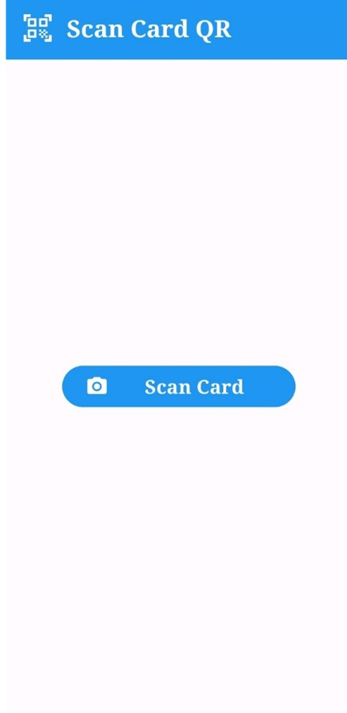
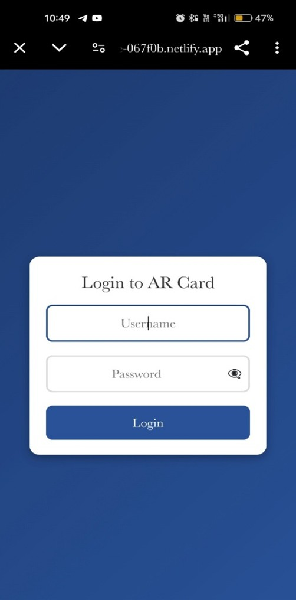
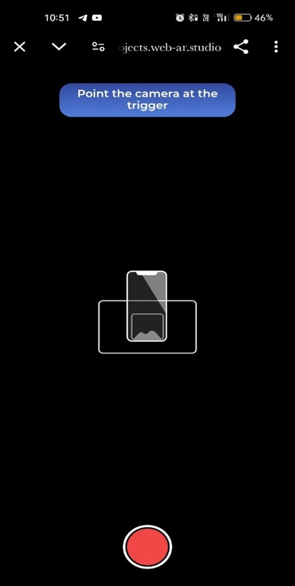
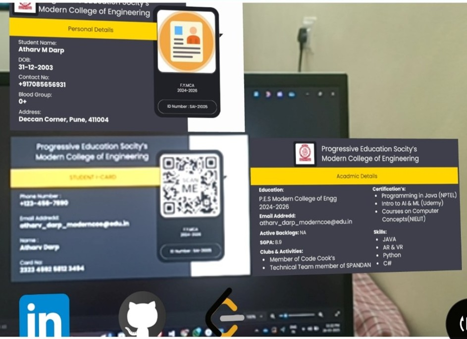

# 🔐 User Authentication System

## 📌 About the Project
The **User Authentication System** is a secure JSP-based web application for user registration and login.  
It supports encrypted password storage, OTP verification, CAPTCHA validation, and custom popup messages.

---

## ✨ Key Features
- Secure **registration** with validation
- **Login** with CAPTCHA and OTP
- **Forgot Password** with OTP reset
- Duplicate email and mobile number checks
- Styled UI for forms and popups

---

## 🛠 Technology Used
- **Frontend:** HTML, CSS, JavaScript
- **Backend:** JSP (Java Server Pages)
- **Database:** OracleXE 10G
- **Editor:** Sublime Text
- **Runtime:** Apache Tomcat

---

## 📸 Output Screens

| App Screen | Login Attempt (External Scan) |
| --- | --- |
|  |  |

| AR Camera Scan | Virtual Card Display |
| --- | --- |
|  |  |

---

© 2025 Dnyanesh Badave | User Authentication System

